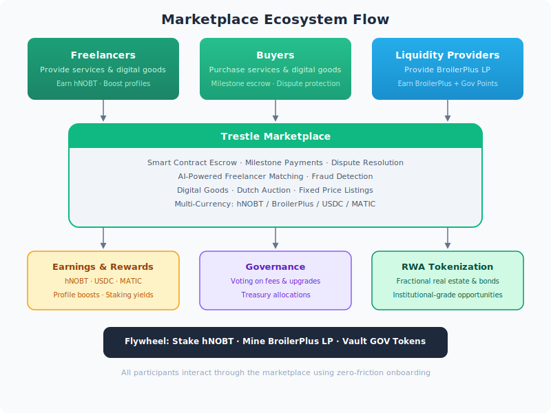

# Marketplace Overview

The **Trestle Marketplace** is a decentralized, multi-sided platform bridging **digital labor**, **digital goods**, and **Real-World Assets (RWA)**. Built on **Polygon**, it leverages a **Dutch Auction** mechanism and **Smart Contract Escrow** to ensure trustless, low-fee transactions.

## Current Status
- **Core Staking:** ✅ **Live on Mainnet** (Polygon)
- **Marketplace Beta:** ✅ **Live on Testnet** (Amoy)
- **Mainnet Launch:** 🚧 **In Development** (Post-Audit)

## Key Features
- **Zero-Friction Onboarding:** Browse and transact via **Telegram Mini-App** or Web UI.
- **Secure Escrow:** Funds are held in smart contracts and released only upon verified work completion.
- **Dutch Auction Pricing:** Prices decrease linearly over time (`getPrice = start - (rate × time)`), allowing for automatic market discovery without order books.
- **Decentralized Dispute Resolution:** Powered by **Kleros** and **Community AI Nodes**.

## The Flywheel
The marketplace is the engine of the Trestle economy:
1. **Freelancers** earn `hNOBT` and `BroilerPlus` for services.
2. **Buyers** spend crypto to access goods, boosting liquidity.
3. **Liquidity Providers** earn fees from transactions via the **Vault**.

