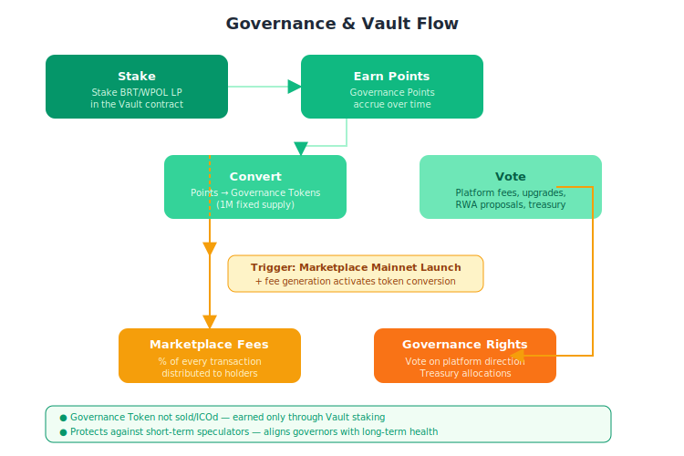

# Governance Model

## Vault (Governance Token Staking)

### Purpose
To earn **Governance Token rewards**, users stake **BroilerPlus LP tokens** in the **Vault**.

### Rewards
Governance Token rewards are distributed based on:
- **Staking duration**
- **Contribution amount**

### Voting Rights
Governance Token holders vote on:
- Platform upgrades
- Marketplace fee structures
- RWA tokenization proposals
- Treasury allocations

## Decentralized Dispute Resolution

### Kleros Integration
A **decentralized arbitration layer** for freelancer escrow disputes.

### Community Jurors
Disputes are resolved by a **pool of jurors** selected from the Trestle community.

## Decentralized AI Integration

### AI Node Operators
- Earn **hNOBT** for providing AI compute and inference
- Run verified open-source models (Llama 3, Mixtral, StableLM)
- Participate in AI governance and reputation scoring

### AI Applications
- **Dispute Resolution**: AI analyzes evidence for fair outcomes
- **Freelancer Matching**: Smart job pairing based on skills/reputation
- **Fraud Detection**: Real-time monitoring for Sybil attacks
- **RWA Verification**: Document analysis and compliance checking
- **Content Moderation**: Automated filtering of inappropriate content

### Benefits
- No central AI authority - community-operated
- Privacy-preserving processing
- Cost-effective through decentralized compute